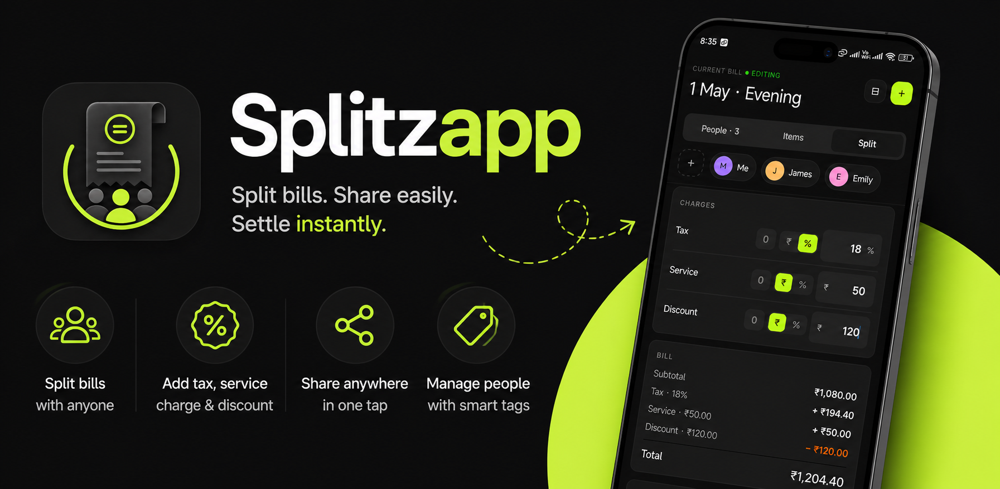

# Splitzapp

Splitzapp makes splitting group bills fast, accurate, and painless.

Whether you're dining out with friends, traveling with cousins, managing office lunches, or sharing gym expenses, Splitzapp helps you calculate exactly who owes what — including taxes, service charges, and discounts distributed proportionally.

No messy calculator work. No confusing spreadsheets.

### Features

- Smart bill splitting for groups

- Automatically distributes taxes, service charges, and discounts fairly

- Share calculated splits instantly through any messaging app

- Copy the full split summary directly to clipboard

- Organize people using tags like Work, Family, Gym, Trip, and more

- Quickly find people from large contact lists

- Learns from your previous bills and suggests items faster over time

- Simple, fast, and built for repeated everyday use

### Perfect for

- Restaurant outings

- Group trips

- Flatmates & roommates

- Team lunches

- Events & parties

- Any shared expense

Splitzapp helps groups settle expenses quickly so you can spend less time calculating and more time enjoying the moment.

## Run

dev server:
`pnpm start`

Before for releases:
`npx expo prebuild`
